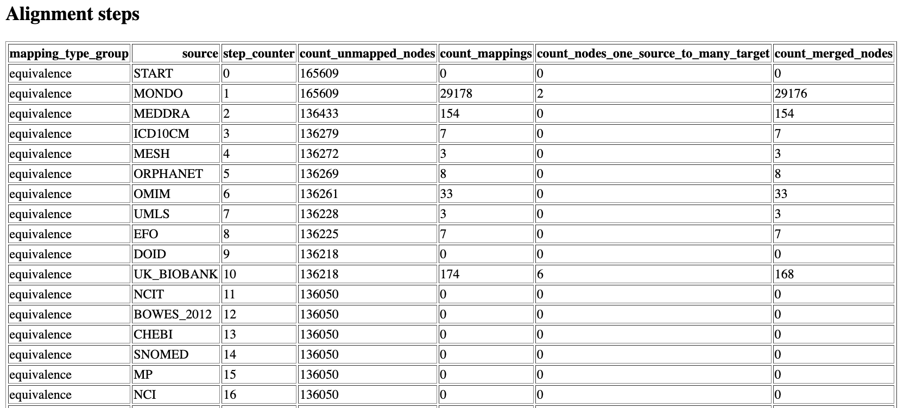

.. _Analysis:

Analysis
=======================

The API concludes the process by producing an analysis that provides summary
and detail of the various steps.

Alignment process report
^^^^^^^^^^^^^^^^^^^^^^^^^

The process report provides a summary and detailed alignment step report.

The summary describes the result of the process in terms of the following
metrics:

* | **input nodes**: the set of nodes that assume to belong to the same domain
  | that most likely contain duplicated, connected and overlapping nodes.
* | **merged nodes**: the set of nodes that are mapped and merged onto other
  | nodes.
* | **connected nodes**: the set of nodes that are not merged onto other nodes,
  | but are connected to the hierarchy
* | **dangling nodes**: the set of nodes that are neither merged nor connected.

Figure :ref:`target to alignment step report` shows the outcome of each
alignment step: how many unmapped nodes where at the start, how many mappings
can be found for the given unmapped node set, how many mappings were
dropped due to multiplicity, and finally how many nodes were merged as the
result of the step.

.. _target to alignment step report:

  Alignment step report.

Pandas profiling
^^^^^^^^^^^^^^^^^^^^^^^^

`Pandas profiling <https://pandas-profiling.ydata.ai/docs/master/index.html>`_
provides a convenient way to examine table data. OntoMerger generates
profiling reports for each tables. Analysing these reports can provide insights
(e.g. what are the missing mappings, and /or hierarchies) for fine tuning the
inputs in order to further reduce duplication, as well as to increase
connectivity.

Data tests
^^^^^^^^^^^^^^^^^^^^^^^^

For more detail please read the :ref:`Data testing` section.
