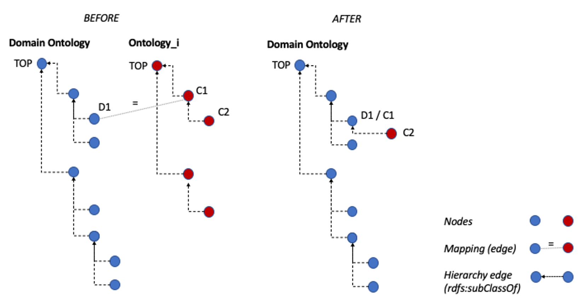

.. _Connectivity:

Connectivity
=======================

The connectivity process takes the available hierarchies and attempts to
produce a single hierarchy (``../output/domain_ontology/edges_hierarchy.csv``).

Connection via mapped parent
-------------------------------

.. _target to connect via mapped parent:

The main idea is depicted in the Figure :ref:`target to connect via mapped
parent figure`.
For each unmapped node, we check whether there is a mapped parent of that node,
and produce a direct hierarchy edge from the unmapped node to the
mapped parent.
The intermediate nodes in the hierarchy are dropped (unless they are also in
the set of unmapped nodes). The result could be a crude *approximation* where
granularity is lost but connectivity is established.

.. _target to connect via mapped parent figure:

  Finding hierarchy fragments for integration via a mapped parent node

Steps
-----------

We start by initialising the *domain hierarchy edge set* as an empty set.

Seed ontology hierarchy
^^^^^^^^^^^^^^^^^^^^^^^^

First we take the hierarchy of the *seed* ontology and filter out any nodes
that do not belong to the domain (these are, by semantics of a concept
hierarchy, must be on other separate hierarchy branches).
This set of hierarchy edges provides the *scaffolding* of the domain ontology
hierarchy.
We add this to the *domain hierarchy edge set*.

Other full hierarchies
^^^^^^^^^^^^^^^^^^^^^^^^

Next, for each source specified in the :ref:`Alignment configuration`
``required_full_hierarchies`` list,
we take the hierarchy and reduce it to several sub-graph where each sub-graph
is a DAG such that the top node in a sub-graph is a node merged to a
*seed* ontology node.
These sub graphs are converted to hierarchy edges and added to the
*domain hierarchy edge set*.
The edge set is converted into a graph.
We find the disconnected sub-graphs and only retain the largest sub-graph
(which must be the seed ontology hierarchy and any other connected parts).

Connecting dangling nodes
^^^^^^^^^^^^^^^^^^^^^^^^^^^

Finally for each unmapped node we apply the method as described in
:ref:`target to connect via mapped parent figure`.

