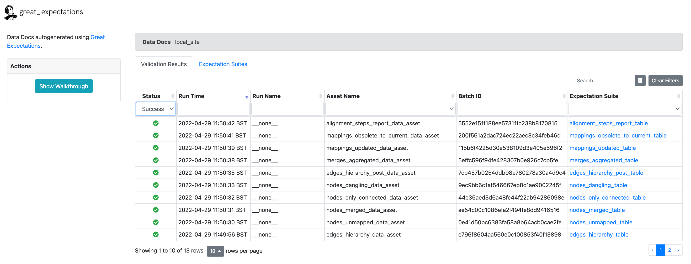
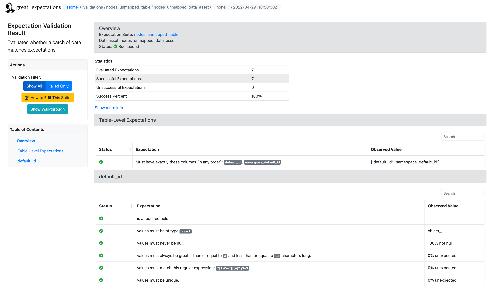

.. _Data testing:

Data testing
==========================

All input and output tables are validated by running *data tests*, using the
`Great Expectations (GE) <https://docs.greatexpectations.io/docs/>`_ framework.

Data tests check *node ID schema*, table schema, and values specified in the
:ref:`Alignment configuration` JSON (e.g. are all the mapping types specified
in the JSON, are all node IDs adhere to the schema etc.).

.. _target to GE overview figure:

  GE tests overview

Data tests can be examined via *data docs*: Figure
:ref:`target to GE overview figure`
shows the overview of all tests, Figure :ref:`target to GE table figure`
shows tests for a given table (``nodes_unmapped.csv``).

.. _target to GE table figure:

  Node table data tests
