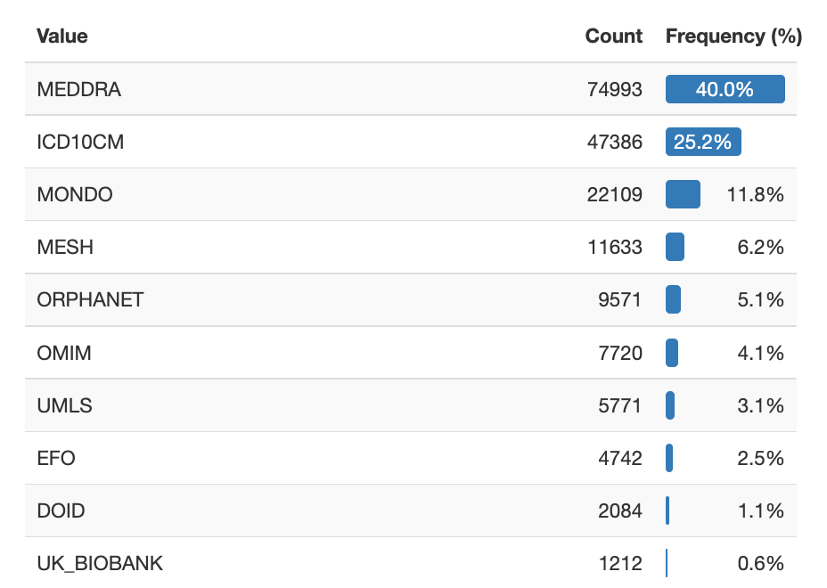

Introduction
=======================

.. include:: intro_short.rst

Overview
========

Motivation
-----------

This library is used in production at the *Biological Insights Knowledge Graph
project (AstraZeneca)*. Throughout this document, we will use real life
examples and statistics from this project. For more details about BIKG, please
read the `paper <link URL>`_.

Knowledge fragmentation
^^^^^^^^^^^^^^^^^^^^^^^^

Building knowledge graphs, especially in the biomedical domain, often involves
integrating data from several overlapping but heterogeneous data sets.  One
data set may provide information about *genes*, another about *diseases*, and
a third about how certain genes are related to a given disease.
Different data sets might use different vocabularies (ontologies, taxanomies
etc.) to refer to the same concepts, causing syntactic and semantic
heterogenity in the integrated data set.

Heterogenity leads to *fragmented knowledge* that hinders the efficacy of
knowledge graphs: we might know what genes are causing the a bronchial disease
asthma, and which drugs can be used for treatment, but if these two statements
(triples) are using different *identifiers*, a *recommender system* would not
pick up this pattern and suggest using the same drug for other related
diseases.

Example of knowledge fragmentation (by merge the two asthma node instances into
 a single node, the two separate statements become connected):

::

    GENE -- participates --> DOID:2841 (Asthma)

                             MONDO:0004979 (Asthma) <-- treats -- COMPOUND

Example of resolving knowledge fragmentation:

::

    DOID:2841 -- merge --> MONDO:0004979

    GENE -- participates --> MONDO:0004979 (Asthma) <-- treats -- COMPOUND

Node duplication
^^^^^^^^^^^^^^^^^

The BIKG data set contains approximately 189k *Disease* nodes from over 16
different sources. The figure below shows the count and frequency of the top
ten Disease sources.

.. _target to node source frequency chart:

  Frequency chart of the top ten *Disease* node sources in the example data
  set.

Data set version discrepancies
^^^^^^^^^^^^^^^^^^^^^^^^^^^^^^

.. _target to version discrepancies:

Data set version discrepancy can also lead to node duplication.  Data sets may
be stale or updated with varying frequency.  Even if two data set use the same
source they might use different versions. This can also cause issues as
concepts can be *deprecated*: in a simple case the a deprecated concept
can get another *identifier* (one to one internal code reassignment).
In a more complex case, a concept may be *removed*, or *split* (refined)
into multiple concepts.

Disconnected nodes
^^^^^^^^^^^^^^^^^^^

Organising domain nodes into a single hierarchy improves ML processes
(pattern recognition). Hierarchies facilitate finding similar nodes based on
neighborhoods (e.g. sibling nodes). Some of the challenges presented by
heterogeneous data sets are that

* | not all nodes have (available) hierarchies (this could be due to licensing
  | issues, dynamic data sets such as BIKG, etc.);
* | hierarchies may be incompatible (e.g. ICD10CM is not a proper hierarchy,
  | whereas MONDO is);
* typically not all nodes can be aligned to the same vocabulary.

As a result, without any intervention, we are left with several vocabulary
fragments, i.e. not a single DAG that properly supports the aforementioned
ML; or an inconsistent hierarchy (loops etc >> todo include refs.).

Method
------------------

The goals of the alignment process are to (1) reduce node duplication of
domain nodes, and (2) to connect the domain nodes. The library *does not aim to
create a merged ontology that retains all knowledge* from the integrated
parts (i.e. all hierarchy connections, and the complete granularity of the
nodes).  Therefore the *methods we employ are approximations* that make use of
the available background knowledge to achieve these goals (availability of
background knowledge is an issue in dynamic settings, especially regarding
mappings, that are often produced and curated by humans).

Scaffolding seed ontology, all are merged onto it and connected to it.
Secondary hierarchies that we try to preserve to some degree.

Using Pandas

Providing analysis and data tests

Running the project

.. code-block:: shell

    $ onto_merger --f PROJECT_FOLDER
